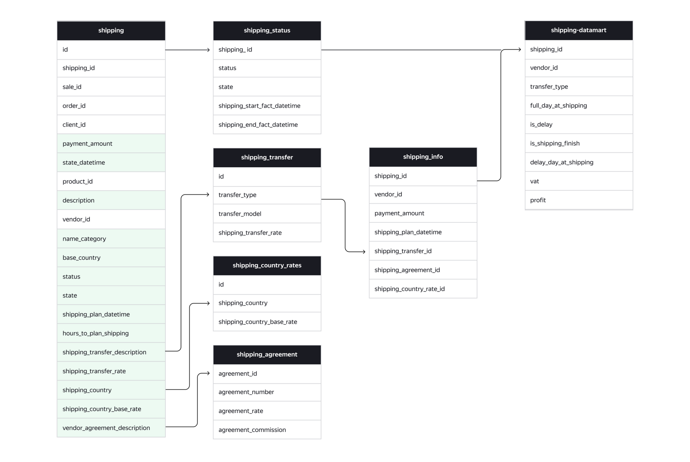

# Проект 2-го спринта
## Описание
Сделать миграцию в отдельные логические таблицы, а затем собрать на них витрину данных.\
Это поможет оптимизировать нагрузку на хранилище и позволит аналитикам, перед которыми стоит задача построить анализ эффективности и прибыльности бизнеса, отвечать на точечные вопросы о тарифах вендоров, стоимости доставки в разные страны, количестве доставленных заказов за последнюю неделю.
---

## Требования и описание создания проекта
1. Выполнить [DDL скрипт](https://github.com/SokolArr/ya_de_portfolio/tree/main/project_2/DDL/DDL.sql)
2. Выполнить [DML скрипт](https://github.com/SokolArr/ya_de_portfolio/tree/main/project_2/DML/DML.sql)

## Итоговый вид схемы


## Техническая информация по запуску
Запустите локально команду:
```bash
docker run -d --rm -p 3000:3000 -p 15432:5432 --name=de-project-sprint-2-server cr.yandex/crp1r8pht0n0gl25aug1/project-sprint-2:latest
```

После того как запустится контейнер, у вас будут доступны:
1. PostgreSQL
2. VSCode
---