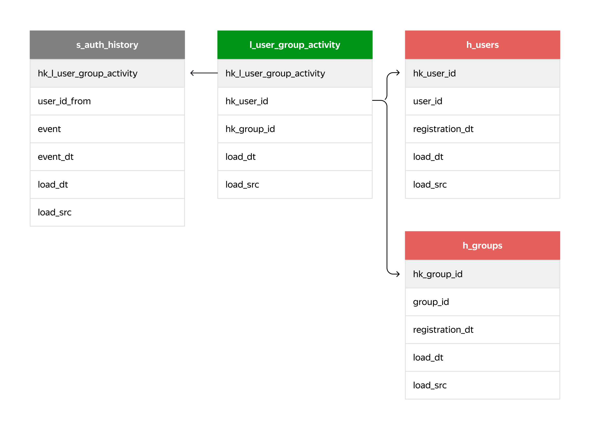

# Проект 5-го спринта
## Описание
Чтобы привлечь новых пользователей, маркетологи хотят разместить на сторонних сайтах рекламу сообществ с высокой активностью. Вам нужно определить группы, в которых начала общаться большая часть их участников. В терминологии маркетинга их бы назвали пабликами с высокой конверсией в первое сообщение.

---

## Требования и описание создания проекта

Необходимо:

1. Перенести из S3 в staging-слой новые данные о входе и выходе пользователей из групп — файл `group_log.csv`.
    
    Лог работы групп `group_log.csv` содержит:
    
    - `group_id` — уникальный идентификатор группы;
    - `user_id` — уникальный идентификатор пользователя;
    - `user_id_from` — поле для отметки о том, что пользователь не сам вступил в группу, а его добавил другой участник. Если пользователя пригласил в группу кто-то другой, поле будет непустым.
    - `event` — действие, которое совершено пользователем `user_id`. Возможны следующие варианты:
        - create — пользователь создал группу;
        - add — пользователь `user_id` вступил сам или был добавлен в группу;
        - leave — пользователь `user_id` покинул группу.
    - `datetime` — время совершения `event`.
2. Создать в слое постоянного хранения таблицы для новых данных. Например, по схеме:

3. Перенести новые данные из staging-области в слой DDS.
4. Рассчитать конверсионные показатели для десяти самых старых групп:
    - количество пользователей, вступивших в группу, — `cnt_added_users`;
    - количество участников группы, которые написали хотя бы одно сообщение, — `cnt_users_in_group_with_messages`;
    - конверсию в первое сообщение из вступления в группу — `group_conversion`.

## Техническая информация по запуску
Запустите локально команду:
```bash
docker run \
-d \
-p 3000:3000 \
-p 3002:3002 \
-p 15432:5432 \
--mount src=airflow_sp5,target=/opt/airflow \
--mount src=lesson_sp5,target=/lessons \
--mount src=db_sp5,target=/var/lib/postgresql/data \
--name=de-sprint-5-server-local \
cr.yandex/crp1r8pht0n0gl25aug1/de-pg-cr-af:latest
```

После того как запустится контейнер, вам будут доступны:
- Airflow
	- `localhost:3000/airflow`
- БД
	- `jovyan:jovyan@localhost:15432/de`
---