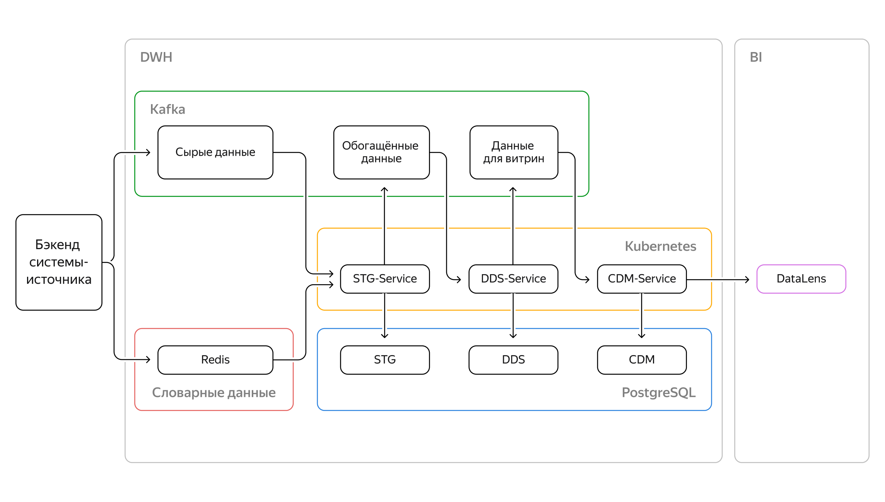
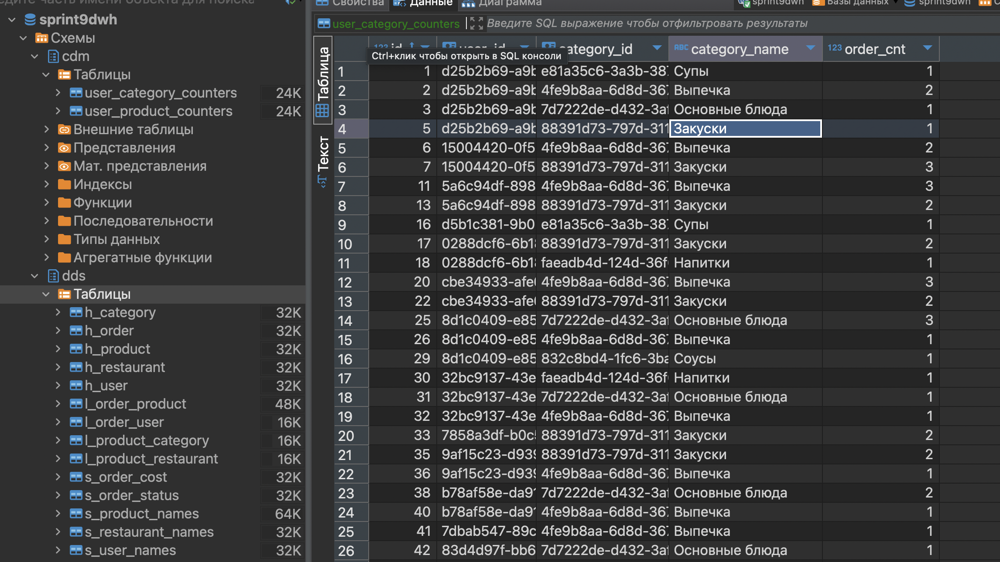
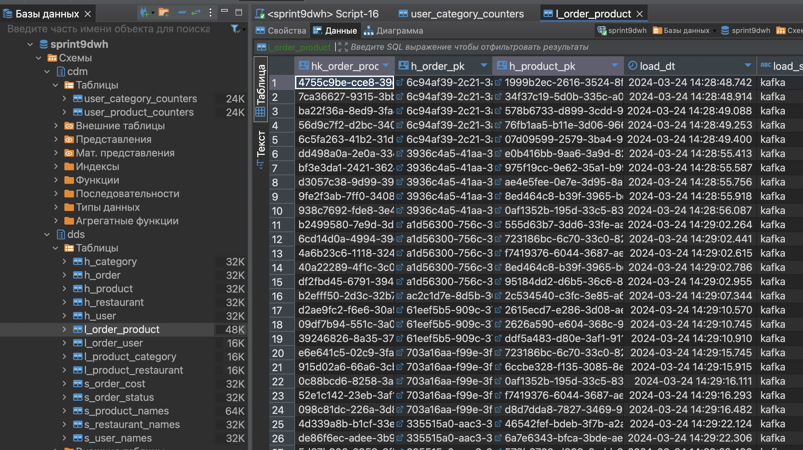
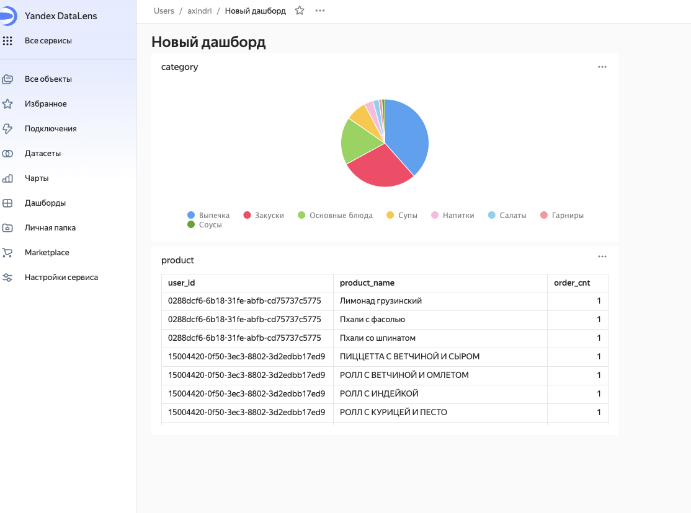

# Проект 8-го спринта
## Описание
В этом проекте вам нужно реализовать два оставшихся сервиса, которые заполняют слои DDS и CDM, и визуализировать данные из витрины в дашборде.
Полная архитектура решения выглядит так:


### Реализованные сервисы, которые передают данные из топика в топик, а также скаладывают данные в хранилище на PostgreSQL
+ ```stg_service```
+ ```dds_service```
+ ```cdm_service```





### Dashboard

---

## Техническая информация по запуску
- Каждый сервис можно запустить через `docker-compose`
- Макропеременные занести через .env для кадого сервиса
---