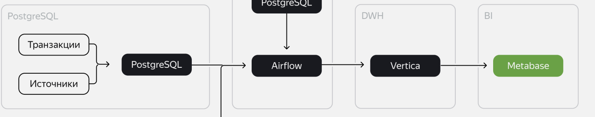
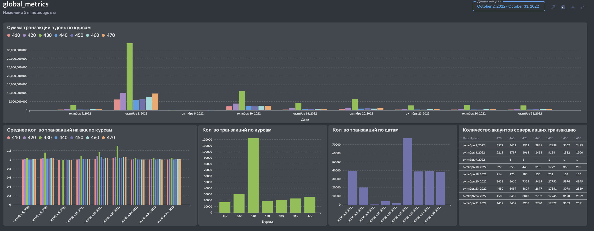
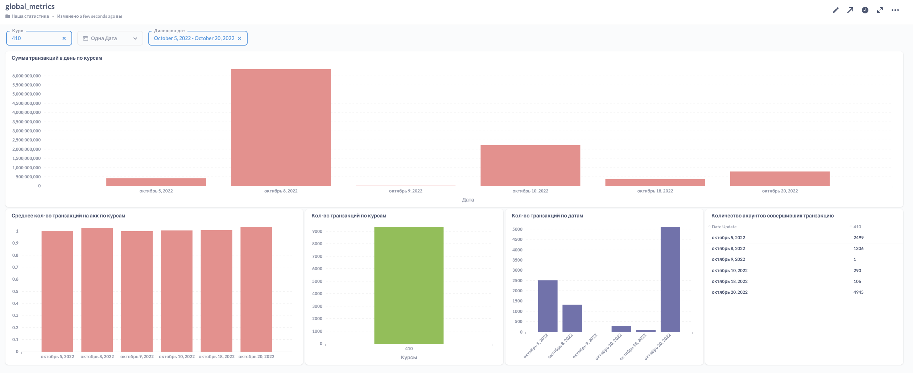
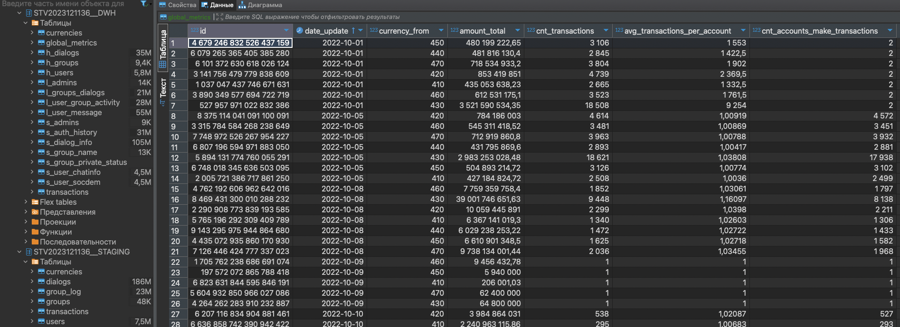
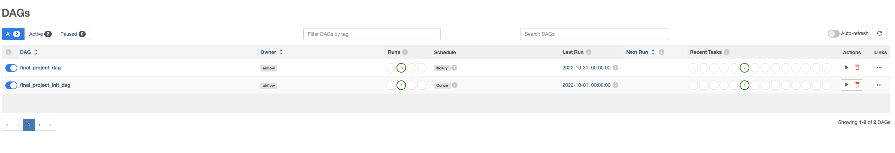

# Проект 9-го спринта
## Описание
Компания придерживается децентрализованной финансовой системы: в каждой стране, где доступно приложение, есть отдельный сервис, работающий с валютой этой страны. При этом компания ведёт учёт транзакционной активности клиентов внутри и между странами: разработан единый протокол передачи данных, который обеспечивает одинаковую структуру таблиц во всех странах.

Финансовая активность пользователей увеличивается, поэтому пришло время провести единый анализ данных. Вам надо объединить информацию из разных источников и подготовить её для аналитики.

## Описание задачи

Команда аналитиков попросила вас собрать данные по транзакционной активности пользователей и настроить обновление таблицы с курсом валют.

Цель — понять, как выглядит динамика оборота всей компании и что приводит к его изменениям.

Данные подготовлены в различных вариантах, так как в компании использовались разные протоколы передачи информации. Поэтому вы можете самостоятельно выбрать источник и решить, каким образом реализовать поставку данных в хранилище.

#### **Входные данные**

Данные **`transactions`** содержат в себе информацию о движении денежных средств между клиентами в разных валютах.

Структура данных:

- `operation_id` — id транзакции;
    
- `account_number_from` — внутренний бухгалтерский номер счёта транзакции ОТ КОГО;
- `account_number_to` — внутренний бухгалтерский номер счёта транзакции К КОМУ;
    
- `currency_code` — трёхзначный код валюты страны, из которой идёт транзакция;
    
- `country` — страна-источник транзакции;
    
- `status` — статус проведения транзакции: `queued` («транзакция в очереди на обработку сервисом»), `in_progress` («транзакция в обработке»), `blocked` («транзакция заблокирована сервисом»), `done` («транзакция выполнена успешно»), `chargeback` («пользователь осуществил возврат по транзакции»).
    
- `transaction_type` — тип транзакции во внутреннем учёте: `authorisation` («авторизационная транзакция, подтверждающая наличие счёта пользователя»), `sbp_incoming` («входящий перевод по системе быстрых платежей»), `sbp_outgoing` («исходящий перевод по системе быстрых платежей»), `transfer_incoming` («входящий перевод по счёту»), `transfer_outgoing` («исходящий перевод по счёту»), `c2b_partner_incoming` («перевод от юридического лица»), `c2b_partner_outgoing` («перевод юридическому лицу»).
    
- `amount` — целочисленная сумма транзакции в минимальной единице валюты страны (копейка, цент, куруш);
    
- `transaction_dt` — дата и время исполнения транзакции до миллисекунд.

Данные **`сurrencies`** — это справочник, который содержит в себе информацию об обновлениях курсов валют и взаимоотношениях валютных пар друг с другом.

Структура данных:

- `date_update` — дата обновления курса валют;
- `currency_code` — трёхзначный код валюты транзакции;
- `currency_code_with` — отношение другой валюты к валюте трёхзначного кода;
- `currency_code_div` — значение отношения единицы одной валюты к единице валюты транзакции.




1. Соберите автобновляемый дашборд:
    
    a. Визуализируйте метрику суммы переводов с возможностью смотреть общую сумму и выбирать отдельные валюты через фильтр.
    
    b. Визуализируйте метрику среднего объема транзакций на пользователя.
    
    c. Визуализируйте метрику количества уникальных пользователей, которые совершают транзакции в валютах.
    
    d. Визуализируйте метрику общего оборота компании в единой валюте.
    
    e. Настройте фильтры по дате и выбранным валютам перевода.
---

### Metabase



### Vertica
```STV2023121136__DWH.global_metrics```


### AirFlow


## Техническая информация по запуску
Настройки (переменные) для DAG: ```src/prefs/variables.json```. Заполнить, импортировать в AirFlow.

В компании запущена **PostgreSQL** для продакшена. Для построения инфраструктуры аналитики и поставки данных предоставлена отдельная PostgreSQL, копия продовой БД. В таблицах `public.transactions` и `public.currencies` есть доступ на загрузку данных.
---